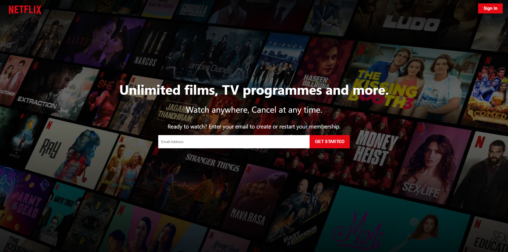
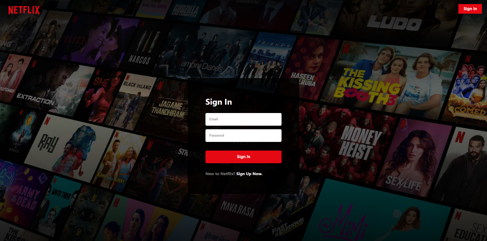
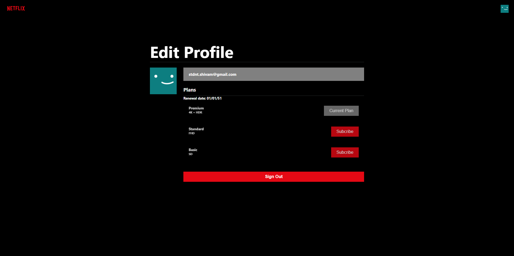
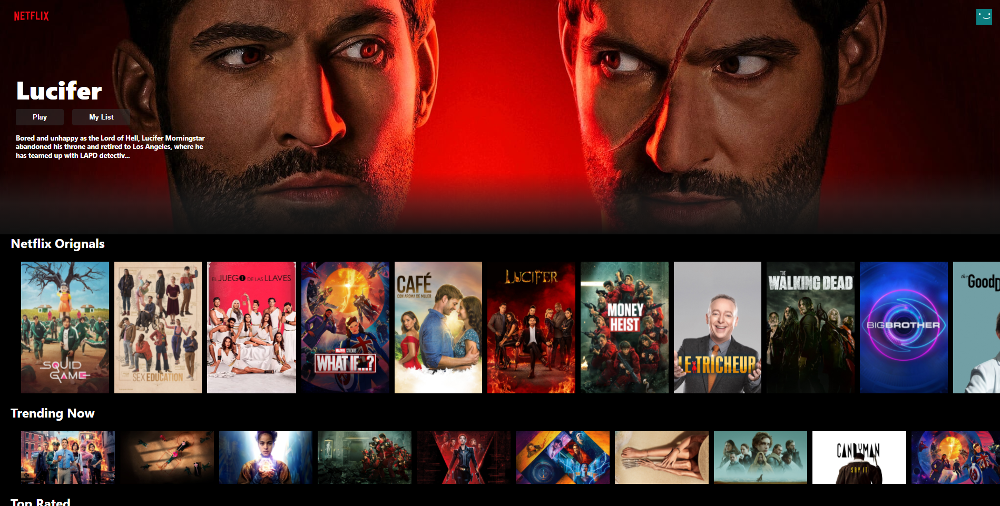

# Netflix Clone

This is a Netflix Clone website built using <b>React, Redux and Firebase.</b>
This Project is deployed [here](https://netflix-d431d.web.app/).

## Method to Run

- Clone this repo to your machine locally.
- Install the dependencies using `npm install` and `yarn install` commands.
- Generate a firebase configs. You can follow [this procedure](https://firebase.google.com/docs/web/learn-more#config-object).
- Paste the configs into `firebase-example.js` and rename the file to `firebase.js`.
- Generate a TMDB API Key by registering [here](https://www.themoviedb.org/).
- Paste the TMDB API Key in `.env-example` and rename the file to `.env`.
- Use command `npm start` to start the server on `localhost:3000`.

## Screenshots

